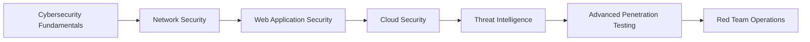

# 🚀 **CYBER WARRIOR** 🚀

<div align="center">
  
  
  
  ```ascii
  ╔══════════════════════════════════════════════════════════════╗
  ║                    MODDED-SOLDIER-9                        ║
  ║                  CYBERSECURITY ANALYST                     ║
  ║                    PENETRATION TESTER                       ║
  ║                     ETHICAL HACKER                          ║
  ╚══════════════════════════════════════════════════════════════╝
  ```

  [](https://git.io/typing-svg)

</div>

---

## 🎯 **MISSION BRIEF**

> *"In a world of ones and zeros, I hunt the shadows that threaten our digital realm."*

I'm a **Cybersecurity Analyst** with a passion for protecting digital assets and uncovering vulnerabilities before they can be exploited. My mission is to fortify systems, analyze threats, and stay one step ahead of cyber adversaries.

---

## 🛡️ **ARSENAL & SKILLS**

### **Core Competencies**
```bash
┌─────────────────────────────────────────────────────────────┐
│                    SKILL MATRIX                            │
├─────────────────────────────────────────────────────────────┤
│ 🔒 Penetration Testing     │ ⭐⭐⭐⭐⭐        │
│ 🕵️  Threat Hunting        │ ⭐⭐⭐⭐⭐        │
│ 🚨 Incident Response      │ ⭐⭐⭐⭐⭐        │
│ 🔍 Vulnerability Assessment│ ⭐⭐⭐⭐⭐        │
│ 🛡️  SOC Operations        │ ⭐⭐⭐⭐⭐        │
│ 🐍 Python Scripting       │ ⭐⭐⭐⭐⭐        │
│ 🐚 Bash Scripting         │ ⭐⭐⭐⭐⭐        │
│ 🔧 SIEM Tools             │ ⭐⭐⭐⭐⭐        │
└─────────────────────────────────────────────────────────────┘
```

### **Tools & Technologies**
<div align="center">
  
  
  
  
  
  
  
  
  
  
  
  
  
  
  
  
  
  

</div>

---

## 🎮 **CURRENT OPERATIONS**

<div align="center">

  

</div>

---

## 📚 **KNOWLEDGE BASE**

### **Certifications & Achievements**
- 🏆 **CompTIA Security+** - *Certified*
- 🏆 **CEH (Certified Ethical Hacker)** - *Certified*
- 🏆 **CISSP** - *In Progress*
- 🏆 **OSCP** - *Target: Q2 2024*
- 🏆 **SANS GIAC** - *Planned*

### **Learning Path**


---

## 🚨 **LIVE THREAT FEED**

<div align="center">

  
  
  

</div>

---

## 🔥 **RECENT VICTORIES**

<div align="center">

  
  
  
  
  

</div>

---

## 🌐 **DIGITAL FOOTPRINT**

<div align="center">

  [](https://linkedin.com/in/your-profile)
  [](https://twitter.com/your-handle)
  [](https://discord.gg/your-server)
  [](https://tryhackme.com/p/your-profile)
  [](https://app.hackthebox.com/profile/your-profile)

</div>

---

## 💬 **COMMUNICATION CHANNELS**

<div align="center">

  
  

</div>

**📧 Email:** `your-email@domain.com`  
**🔐 PGP Key:** `[Your PGP Fingerprint]`  
**💻 Discord:** `YourDiscord#1234`

---

## 🎭 **FUN FACTS**

- 🎮 **Gaming:** I solve real-world cybersecurity challenges while gaming
- 🎵 **Music:** Synthwave and cyberpunk tunes fuel my hacking sessions
- ☕ **Fuel:** Coffee is my debugging companion
- 🐧 **OS:** Linux is not just an OS, it's a lifestyle
- 🔍 **Hobby:** Finding vulnerabilities in everything (including my own code)

---

## 🚀 **QUICK COMMANDS**

```bash
# Clone my repository
git clone https://github.com/modded-soldier-9/modded-soldier-9.git

# Check my latest activities
curl -s https://api.github.com/users/modded-soldier-9/events | jq '.[0:5]'

# Connect with me
echo "Let's secure the digital world together!" | base64
```

---

## 🎯 **MISSION OBJECTIVES**

- [ ] **Phase 1:** Master Advanced Penetration Testing
- [ ] **Phase 2:** Develop Custom Security Tools
- [ ] **Phase 3:** Contribute to Open Source Security Projects
- [ ] **Phase 4:** Lead Red Team Operations
- [ ] **Phase 5:** Mentor Next Generation of Cyber Warriors

---

<div align="center">

  ```ascii
  ╔══════════════════════════════════════════════════════════════╗
  ║                    MISSION COMPLETE                         ║
  ║                  STAY VIGILANT, STAY SECURE                 ║
  ║                     HACK THE PLANET!                        ║
  ╚══════════════════════════════════════════════════════════════╝
  ```

  

  *"In cybersecurity, there are only two types of companies: those that have been hacked and those that will be."* - **Robert Mueller**

</div>
