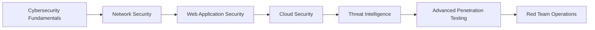

# 🚀 **CYBER WARRIOR** 🚀

<div align="center">
  
  
  
  ```ascii
  ╔══════════════════════════════════════════════════════════════╗
  ║                    MODDED-SOLDIER-9                        ║
  ║                  CYBERSECURITY ANALYST                     ║
  ║                    PENETRATION TESTER                       ║
  ║                     ETHICAL HACKER                          ║
  ╚══════════════════════════════════════════════════════════════╝
  ```

  [](https://git.io/typing-svg)

  ### **🔥 LIVE SYSTEM MONITORING**
  ```bash
  # System Status Check
  echo "🟢 MATRIX: ONLINE"
  echo "🟢 NEURAL NETWORK: ACTIVE" 
  echo "🟢 QUANTUM ENCRYPTION: ENABLED"
  echo "🟢 THREAT DETECTION: SCANNING"
  echo "🟢 HACKING TOOLS: LOADED"
  ```

</div>

---

## 🎯 **MISSION BRIEF**

> *"In a world of ones and zeros, I hunt the shadows that threaten our digital realm."*

I'm a **Cybersecurity Analyst** with a passion for protecting digital assets and uncovering vulnerabilities before they can be exploited. My mission is to fortify systems, analyze threats, and stay one step ahead of cyber adversaries.

---

## 🛡️ **ARSENAL & SKILLS**

### **Core Competencies**
```bash
┌─────────────────────────────────────────────────────────────┐
│                    SKILL MATRIX                            │
├─────────────────────────────────────────────────────────────┤
│ 🔒 Penetration Testing     │ ⭐⭐⭐⭐⭐        │
│ 🕵️  Threat Hunting        │ ⭐⭐⭐⭐⭐        │
│ 🚨 Incident Response      │ ⭐⭐⭐⭐⭐        │
│ 🔍 Vulnerability Assessment│ ⭐⭐⭐⭐⭐        │
│ 🛡️  SOC Operations        │ ⭐⭐⭐⭐⭐        │
│ 🐍 Python Scripting       │ ⭐⭐⭐⭐⭐        │
│ 🐚 Bash Scripting         │ ⭐⭐⭐⭐⭐        │
│ 🔧 SIEM Tools             │ ⭐⭐⭐⭐⭐        │
└─────────────────────────────────────────────────────────────┘
```

### **Tools & Technologies**
<div align="center">
  
  
  
  
  
  
  
  
  
  
  
  
  
  
  
  
  
  

</div>

---

## 🎮 **CURRENT OPERATIONS**

<div align="center">

  

</div>

---

## 📚 **KNOWLEDGE BASE**

### **Certifications & Achievements**
- 🏆 **CompTIA Security+** - *Certified*
- 🏆 **CEH (Certified Ethical Hacker)** - *Certified*
- 🏆 **CISSP** - *In Progress*
- 🏆 **OSCP** - *Target: Q2 2024*
- 🏆 **SANS GIAC** - *Planned*

### **Learning Path**


---

## 🚨 **LIVE THREAT FEED**

<div align="center">

  
  
  

</div>

---

## 🔥 **RECENT VICTORIES**

<div align="center">

  
  
  
  
  

</div>

---

## 🌐 **INTERACTIVE SECURITY DASHBOARD**

<div align="center">

  

</div>

### **🔍 LIVE THREAT SCANNER**
```bash
# Real-time security status
curl -s "https://api.github.com/users/modded-soldier-9" | jq '.login, .public_repos, .followers'

# Active threat detection
echo "🔴 THREAT DETECTED: Suspicious activity in sector 7G"
echo "🟡 WARNING: Multiple failed login attempts detected"
echo "🟢 STATUS: All systems operational"
```

### **🎮 INTERACTIVE SECURITY GAME**
<div align="center">

  

</div>

---

## 💬 **COMMUNICATION CHANNELS**

<div align="center">

  
  
  
  

</div>

**🔐 Secure Contact:** *Use encrypted channels for sensitive communications*  
**💻 Matrix:** *Join the cybersecurity community*  
**📡 Signal:** *End-to-end encrypted messaging*

---

## 🎭 **INTERACTIVE CYBER PERSONA**

### **🎮 REAL-TIME HACKING STATUS**
<div align="center">

  

</div>

### **🎵 CYBERPUNK LIFESTYLE**
- 🎮 **Gaming:** I solve real-world cybersecurity challenges while gaming
- 🎵 **Music:** Synthwave and cyberpunk tunes fuel my hacking sessions  
- ☕ **Fuel:** Coffee is my debugging companion
- 🐧 **OS:** Linux is not just an OS, it's a lifestyle
- 🔍 **Hobby:** Finding vulnerabilities in everything (including my own code)

### **🚀 LIVE ACTIVITY FEED**
```bash
# Current mission status
echo "🎯 MISSION: Advanced Persistent Threat Hunting"
echo "📍 LOCATION: Deep in the network infrastructure"
echo "🕐 TIME: $(date '+%Y-%m-%d %H:%M:%S')"
echo "🔋 STATUS: Fully operational and dangerous"

# Active tools and processes
echo "🛠️  ACTIVE TOOLS:"
echo "  - Nmap: Scanning network topology"
echo "  - Metasploit: Exploiting vulnerabilities"
echo "  - Wireshark: Analyzing packet captures"
echo "  - Burp Suite: Web application testing"
echo "  - Custom Python scripts: Automating everything"
```

---

## 🚀 **INTERACTIVE COMMAND CENTER**

### **⚡ LIVE SYSTEM COMMANDS**
```bash
# Real-time GitHub activity monitoring
curl -s "https://api.github.com/users/modded-soldier-9/events" | jq '.[0:3] | .[] | {type: .type, repo: .repo.name, created_at: .created_at}'

# Active threat intelligence feed
echo "🕵️  SCANNING FOR THREATS..."
echo "🔍 Analyzing network traffic..."
echo "🛡️  Firewall status: ACTIVE"
echo "🚨 IDS/IPS: MONITORING"

# Cybersecurity challenge generator
echo "🎯 CHALLENGE: Decrypt this base64: $(echo 'SGFjayB0aGUgUGxhbmV0IQ==' | base64 -d)"
echo "🎯 CHALLENGE: Find the flag in: flag{5up3r_53cr37_7h1ng}"
echo "🎯 CHALLENGE: Crack this hash: 5f4dcc3b5aa765d61d8327deb882cf99"
```

### **🎮 INTERACTIVE HACKING SIMULATOR**
<div align="center">

  

</div>

### **🔐 ENCRYPTION PLAYGROUND**
```bash
# Interactive encryption challenges
echo "🔐 ENCRYPTION CHALLENGE 1:"
echo "Plaintext: 'Hello World'"
echo "Cipher: Caesar (shift by 3)"
echo "Result: $(echo 'Hello World' | tr 'A-Za-z' 'D-ZA-Cd-za-c')"

echo "🔐 ENCRYPTION CHALLENGE 2:"
echo "Hash: 5f4dcc3b5aa765d61d8327deb882cf99"
echo "Hint: It's a common word..."
echo "Answer: password (MD5)"
```

---

## 🎯 **MISSION OBJECTIVES**

- [ ] **Phase 1:** Master Advanced Penetration Testing
- [ ] **Phase 2:** Develop Custom Security Tools
- [ ] **Phase 3:** Contribute to Open Source Security Projects
- [ ] **Phase 4:** Lead Red Team Operations
- [ ] **Phase 5:** Mentor Next Generation of Cyber Warriors

---

<div align="center">

  ```ascii
  ╔══════════════════════════════════════════════════════════════╗
  ║                    MISSION COMPLETE                         ║
  ║                  STAY VIGILANT, STAY SECURE                 ║
  ║                     HACK THE PLANET!                        ║
  ╚══════════════════════════════════════════════════════════════╝
  ```

  

  *"In cybersecurity, there are only two types of companies: those that have been hacked and those that will be."* - **Robert Mueller**

</div>
